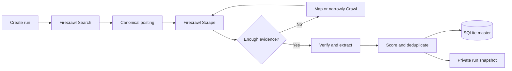

<p align="center">
  <a href="https://firecrawl.dev">
    
  </a>
</p>

<h1 align="center">Structured Job Research with Firecrawl</h1>

<p align="center">
  A private-first, local job-research system that turns focused web searches into verified,
  scored, deduplicated SQLite records and permanent run folders.
</p>

<p align="center">
  
  
  
  
</p>

This repository contains the reusable engine. Search history, source snapshots, databases,
exports, resumes, credentials, and personal targeting rules stay local through `.gitignore`.
It does not provide application submission, outreach, account creation, or a web interface.

## How it works



Each search starts in a dated directory such as `runs/2026-10-02-run-001/`. That folder holds
the run plan, selected records, CSV snapshot, discovery results, source evidence, and reviewed
exclusions. `jobs.db` remains the deduplicated master tracker across all runs.

## Repository contents

| File | Purpose |
|---|---|
| `schema.sql` | One-table SQLite schema, field constraints, and duplicate keys |
| `jobs.py` | Validates, scores, imports, exports, and updates review status |
| `run_manager.py` | Creates standard run folders and finalizes run snapshots |
| `.gitignore` | Keeps personal research data and credentials out of Git |

The implementation uses only the Python standard library.

## Install Firecrawl

Firecrawl provides web search, page scraping, site mapping, crawling, and browser interaction.
The commands below follow the current [official CLI documentation](https://docs.firecrawl.dev/sdks/cli).

Install the CLI and agent skills:

```bash
npx -y firecrawl-cli@latest init --all --browser
```

Alternatively, install only the CLI:

```bash
npm install -g firecrawl-cli
firecrawl login --browser
```

Restart Codex after installing skills, then verify the session:

```bash
firecrawl --status
firecrawl search "site:example.com careers data analyst" --limit 3
```

Authentication can also use `FIRECRAWL_API_KEY`, stored outside the repository. Never commit
API keys, login state, cookies, or raw application material.

## Initialize the local tracker

```bash
python3 -m venv .venv
.venv/bin/python jobs.py init
```

This creates the ignored local `jobs.db`. SQL `NULL` is used for facts that a source does not
explicitly provide; the workflow does not guess salary, posting date, experience, sponsorship,
or work-authorization requirements.

## Start a research run

```bash
.venv/bin/python run_manager.py new \
  --date 2026-10-02 \
  --scope "Focused US analytics search" \
  --target-count 10
```

The command creates:

```text
runs/YYYY-MM-DD-run-NNN/
├── README.md                 # plan, results, and verification notes
├── run.json                  # scope, status, counts, and timestamps
├── jobs.json                 # reviewed structured records
├── jobs.csv                  # generated final snapshot
├── discovery/                # Firecrawl search and map results
├── evidence/                 # sources supporting selected jobs
└── reviewed-not-selected/    # investigated exclusions
```

## Firecrawl research workflow

### 1. Discover a focused candidate set

Search by responsibility, industry, location, company, and ATS. Keep the result set small
enough to review carefully.

```bash
firecrawl search \
  "credit risk analytics Python SQL early career United States jobs" \
  --limit 10 --json \
  -o runs/2026-10-02-run-001/discovery/credit-risk.json
```

A search result is only a lead. It does not prove that the role is open or that its snippet is
current.

### 2. Scrape the canonical posting

Prefer the company careers site or its official ATS posting. Scrape every shortlisted role.

```bash
firecrawl scrape "https://company.example/careers/job-id" \
  --only-main-content --json \
  -o runs/2026-10-02-run-001/evidence/company-role.json
```

Confirm that the saved page matches the company, title, location, and responsibilities. Look
for closure messages, generic-careers redirects, and a live job-specific application path.
Merely receiving HTTP 200 is insufficient evidence that a job is open.

### 3. Map or crawl only when needed

Use Map to locate relevant pages on a known careers site:

```bash
firecrawl map "https://company.example/careers" \
  --search "risk analytics" --json --pretty \
  -o runs/2026-10-02-run-001/discovery/company-risk-urls.json
```

Use Crawl for a narrow careers section when several linked pages must be inspected:

```bash
firecrawl crawl "https://company.example/careers" \
  --include-paths /careers/jobs \
  --limit 25 --max-depth 2 --wait --pretty \
  -o runs/2026-10-02-run-001/discovery/company-careers.json
```

Start with Search and Scrape. Use Interact only when required content needs a click or other
page interaction and ordinary scraping cannot retrieve it. This project never fills or submits
application forms.

### 4. Review and structure the records

Add selected jobs to the run's `jobs.json`. Each record keeps factual fields, canonical URL,
availability evidence, fit-score components, concerns, and a project-relative `source_file`
inside that run's `evidence/` directory.

Deduplication uses these identities:

1. Canonical URL
2. Company plus employer-scoped job ID
3. Company plus normalized title and location

Official postings replace aggregator discoveries when both describe the same job.

### 5. Finalize the run

```bash
.venv/bin/python run_manager.py finalize \
  runs/2026-10-02-run-001 \
  --expected-count 10
```

Finalization:

- requires every selected record to reference saved evidence inside its run;
- validates fields, score components, dates, status values, and URLs;
- imports or updates deduplicated records in `jobs.db`;
- preserves existing user-review statuses;
- refreshes the private master `jobs.csv`;
- writes the run-specific CSV and updates the local run index.

## Review statuses

Records support `new`, `review`, `apply`, `applied`, `interview`, `rejected`, `closed`, and
`skip`. Update a record using its local SQLite ID:

```bash
.venv/bin/python jobs.py status --job-id 1 --status review
.venv/bin/python jobs.py export
```

The status command changes only the review label. It does not visit a website or perform an
external action.

## Privacy model

Git contains the reusable code and this guide. The default ignore rules exclude:

- all `runs/` research history and Firecrawl source snapshots;
- SQLite databases and CSV or spreadsheet exports;
- personal search policies and local agent instructions;
- resumes, cover letters, PDFs, Word documents, and application material;
- environment files, credentials, cookies, private keys, and editor state.

Before any push, confirm the boundary:

```bash
git status --short
git check-ignore jobs.db jobs.csv runs/ .firecrawl/ .env
```

If a sensitive file was committed previously, adding it to `.gitignore` does not remove it from
Git history. Remove it from tracking and rotate any exposed credential before publishing.

## Design principles

- Optimize for a small set of high-quality, verified roles.
- Read the actual posting; do not score from titles or snippets alone.
- Prefer canonical company and ATS sources over aggregators.
- Store explicit `NULL` values instead of invented facts.
- Keep score components visible and reproducible.
- Separate factual job availability from the user's review status.
- Preserve each run as a private, auditable snapshot.
- Keep the system local, simple, and research-only.

## References

- [Firecrawl CLI documentation](https://docs.firecrawl.dev/sdks/cli)
- [Firecrawl Scrape](https://docs.firecrawl.dev/features/scrape)
- [Firecrawl Map](https://docs.firecrawl.dev/features/map)
- [Firecrawl repository](https://github.com/firecrawl/firecrawl)
