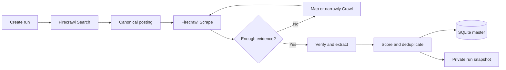

<p align="center">
  <a href="https://firecrawl.dev">
    
  </a>
</p>

<h1 align="center">Structured Job Research with Firecrawl</h1>

<p align="center">
  A private-first, local job-research system that turns focused web searches into verified,
  scored, deduplicated SQLite records and permanent run folders.
</p>

<p align="center">
  
  
  
  
</p>

This repository contains the reusable engine. Search history, source snapshots, databases,
exports, resumes, credentials, and personal targeting rules stay local through `.gitignore`.
It does not provide application submission, outreach, account creation, or a web interface.

## How it works



Each search starts in a dated directory such as `runs/2026-10-02-run-001/`. That folder holds
the run plan, selected records, CSV snapshot, discovery results, source evidence, and reviewed
exclusions. `jobs.db` remains the deduplicated master tracker across all runs.

## Repository contents

| File | Purpose |
|---|---|
| `employment_agent/` | Organized Python package containing the CLI, schema, validation, run management, and workflow engine |
| `research.py` | Small compatibility launcher for the package CLI |
| `tests/` | Offline standard-library tests using temporary databases and mocked commands |
| `.gitignore` | Keeps personal research data and credentials out of Git |

The implementation uses only the Python standard library.

## Install Firecrawl

Firecrawl provides web search, page scraping, site mapping, crawling, and browser interaction.
The commands below follow the current [official CLI documentation](https://docs.firecrawl.dev/sdks/cli).

Install the CLI and agent skills:

```bash
npx -y firecrawl-cli@latest init --all --browser
```

Alternatively, install only the CLI:

```bash
npm install -g firecrawl-cli
firecrawl login --browser
```

Restart Codex after installing skills, then verify the session:

```bash
firecrawl --version
firecrawl --status
```

Authentication can also use `FIRECRAWL_API_KEY`, stored outside the repository. Never commit
API keys, login state, cookies, or raw application material.

## Initialize the local tracker

```bash
python3 -m venv .venv
.venv/bin/python -m employment_agent.jobs init
```

This creates the ignored local `jobs.db`. SQL `NULL` is used for facts that a source does not
explicitly provide; the workflow does not guess salary, posting date, experience, sponsorship,
or work-authorization requirements.

## Terminal workflow

The supported workflow is:

```text
plan → discover → triage → verify → finalize → review
```

`discover` and `verify` are dry-run commands by default. They write reviewable request plans
but cannot call Firecrawl unless `--execute` is supplied explicitly. Creating a plan or a dry
run does not authorize execution; only use `--execute` as part of a separately authorized
research run.

### 1. Plan

```bash
.venv/bin/python research.py plan \
  --date 2026-10-02 \
  --scope "Focused US analytics search" \
  --target-count 10 \
  --focus "credit risk analytics" \
  --locations "Chicago" \
  --locations "Remote US"
```

The current policy rejects targets above ten. Daily focus, locations, include/exclude company
lists, freshness preference, company cap, secondary-track allocation, cache age, stopping rule,
and operation budgets are stored in `plan.json`; they do not rewrite `SEARCH_POLICY.md`.

Default ten-job budgets are 20 searches, 30 scrapes, 4 maps, 2 crawls, and 2 read-only
interactions. These are local call ceilings, not estimates of Firecrawl pricing or credits.

The command creates a run layout like:

```text
runs/YYYY-MM-DD-run-NNN/
├── README.md                 # plan, results, and verification notes
├── plan.json                 # reviewed daily preferences and hard budgets
├── run.json                  # scope, status, counts, and timestamps
├── jobs.json                 # reviewed structured records
├── jobs.csv                  # generated final snapshot
├── candidates.json           # local triage ledger and discovery provenance
├── verification-plan.json    # progressive, read-only verification requests
├── usage.jsonl               # planned/attempted/success/failed/cache events
├── coverage.json             # run and rolling-master diversity report
├── manifest.json             # hashes, sizes, counts, and local tool versions
├── discovery/                # Firecrawl search and map results
├── evidence/                 # sources supporting selected jobs
├── evidence-digests/         # compact, provenance-tagged extraction summaries
└── reviewed-not-selected/    # investigated exclusions
```

### 2. Discover

Prepare the balanced query matrix without making a request:

```bash
.venv/bin/python research.py discover runs/2026-10-02-run-001
```

After reviewing `discovery/request-plan.json`, a separately authorized run can execute it:

```bash
.venv/bin/python research.py discover runs/2026-10-02-run-001 --execute
```

The query plan rotates role concepts, locations, company archetypes, ATS domains, broad
company-independent discovery, and a limited company-specific portion. Equivalent requests
share a SHA-256 fingerprint. An identical successful request can be reused only within the
same run and cache-age window. Four consecutive zero-yield searches stop execution by default.

Every operation writes accounting events with its fingerprint, timing, result/page count,
output, reported credits when the CLI supplies them, and failure category. Local budgets are
enforced even when credit data is absent. Search results remain unverified discovery leads.

### 3. Triage

```bash
.venv/bin/python research.py triage runs/2026-10-02-run-001
```

Triage normalizes and deduplicates URLs before any verification scrape, merges discovery
provenance, marks URLs already in the master database, and records retain/reject reasons.
Aggregator results are held for canonical-URL resolution and are not treated as canonical
evidence. Snippets never establish openness, posting facts, or a verified fit score.

### 4. Verify

Prepare the progressive verification plan without making a request:

```bash
.venv/bin/python research.py verify runs/2026-10-02-run-001
```

For an authorized execution:

```bash
.venv/bin/python research.py verify runs/2026-10-02-run-001 --execute
```

Verification escalates only as needed: main-content markdown and links, then additional
metadata/raw HTML, narrow Map, path-limited Crawl, and finally a fixed read-only Interact DOM
inspection. The command builder has no form-fill, click, login, account, upload, or submission
operation. Canonical responses go directly into the run rather than a second permanent
`.firecrawl` copy.

Each shortlisted source retains its complete canonical response. A separate compact digest
records source facts, calculated values, reviewer judgments, and true unknowns independently,
with evidence pointers and the canonical file's SHA-256. Digests reduce repeated context; they
never replace or discard canonical evidence.

### 5. Finalize

```bash
.venv/bin/python research.py finalize runs/2026-10-02-run-001 --expected-count 10
```

Finalization validates and stages everything before replacing persistent outputs. It rejects
completed runs, wrong counts, within-run duplicates, conflicting master identities, unsafe or
missing evidence, inconsistent derived scores, and future dates. Deduplication uses:

1. Canonical URL
2. Company plus employer-scoped job ID
3. Company plus normalized title and location

Evidence must be a regular, non-symlink file below the current run's `evidence/` directory.
The import occurs in a temporary database copy, passes SQLite integrity and unique-export-count
checks, and then promotes the database, CSVs, coverage, metadata, and manifest with rollback on
promotion failure. Existing user-review statuses are preserved. Official sources supersede
aggregators, never the reverse.

`coverage.json` reports company concentration, role family, geography, freshness, explicit
company archetype, and primary/secondary tracks for the run and rolling master. Concentration
thresholds produce warnings; they never silently replace a stronger selected job.

### 6. Review

Review is plain terminal output and never visits a posting:

```bash
.venv/bin/python research.py review list
.venv/bin/python research.py review show --job-id 1
.venv/bin/python research.py review set --job-id 1 --status review --reason GREAT_FIT
.venv/bin/python research.py review feedback
```

Review events are append-only feedback records separate from factual availability. Feedback
summaries can propose the next query mix, but cannot silently alter permanent preferences or
scoring weights.

## Deterministic policy and migration

The importer calculates freshness, recency points, neutral company points, geography points,
total score, and fit category. Only statistics/ML, finance/risk, seniority, and technical-fit
components remain explicit reviewer judgments. Missing or null derived fields are supported for
legacy records; supplied inconsistent values are rejected.

Schema migration is idempotent and additive. It adds controlled `source_type`, optional source
detail/archetype/digest fields, and review events without backfilling old source strings or
rewriting historical runs.

## Tests

All tests are offline and use temporary run roots, temporary SQLite databases, fixture
responses, and injected command runners:

```bash
python3 -m unittest discover -s tests -v
python3 -m compileall -q employment_agent research.py tests
```

The suite never runs a Firecrawl network operation and never touches the private `jobs.db`,
`jobs.csv`, `.firecrawl/`, or existing `runs/` history.

## Privacy model

Git contains the reusable code and this guide. The default ignore rules exclude:

- all `runs/` research history and Firecrawl source snapshots;
- SQLite databases and CSV or spreadsheet exports;
- personal search policies and local agent instructions;
- resumes, cover letters, PDFs, Word documents, and application material;
- environment files, credentials, cookies, private keys, and editor state.

Before any push, confirm the boundary:

```bash
git status --short
git check-ignore jobs.db jobs.csv runs/ .firecrawl/ .env
```

If a sensitive file was committed previously, adding it to `.gitignore` does not remove it from
Git history. Remove it from tracking and rotate any exposed credential before publishing.

## Design principles

- Optimize for a small set of high-quality, verified roles.
- Read the actual posting; do not score from titles or snippets alone.
- Prefer canonical company and ATS sources over aggregators.
- Store explicit `NULL` values instead of invented facts.
- Keep score components visible and reproducible.
- Separate factual job availability from the user's review status.
- Preserve each run as a private, auditable snapshot.
- Keep the system local, simple, and research-only.

## References

- [Firecrawl CLI documentation](https://docs.firecrawl.dev/sdks/cli)
- [Firecrawl Scrape](https://docs.firecrawl.dev/features/scrape)
- [Firecrawl Map](https://docs.firecrawl.dev/features/map)
- [Firecrawl repository](https://github.com/firecrawl/firecrawl)
